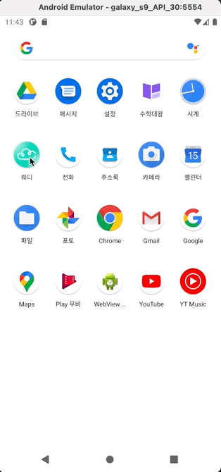
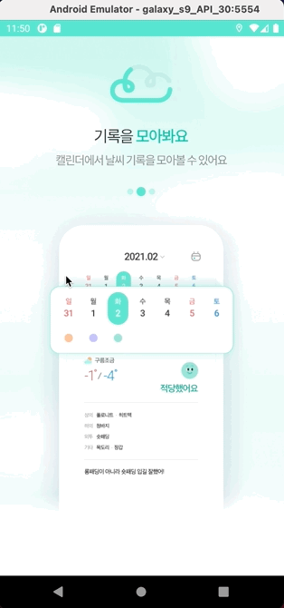
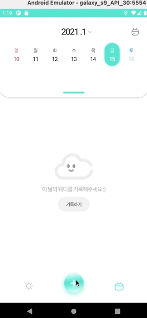
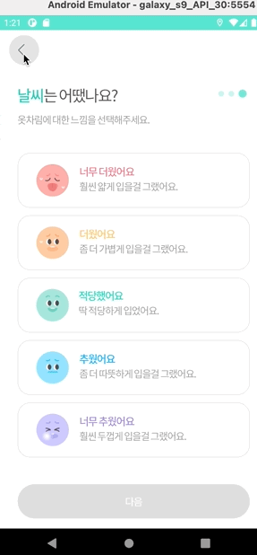
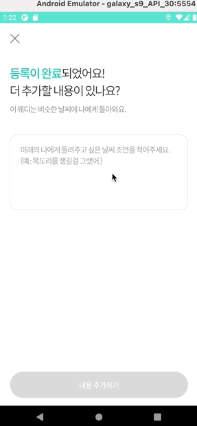
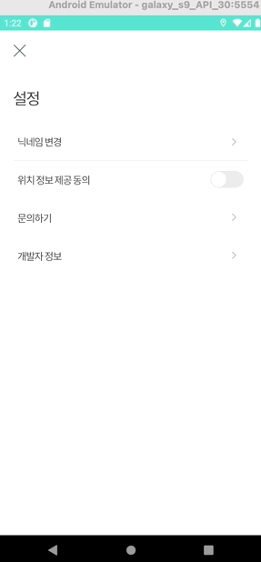
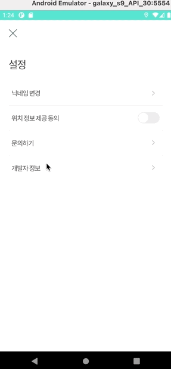
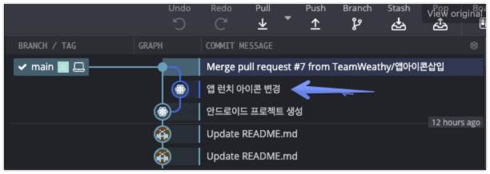
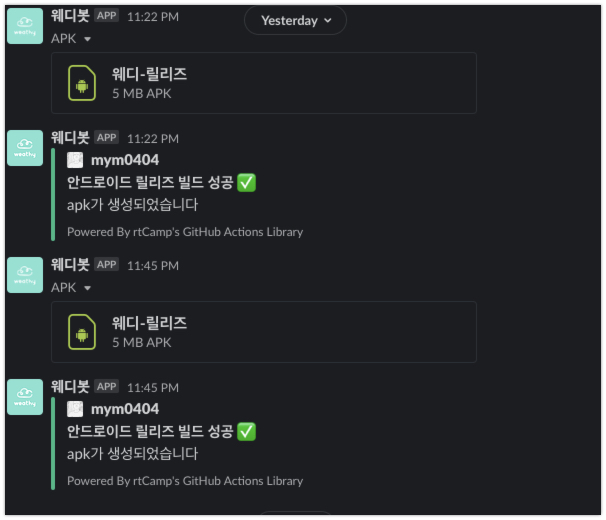
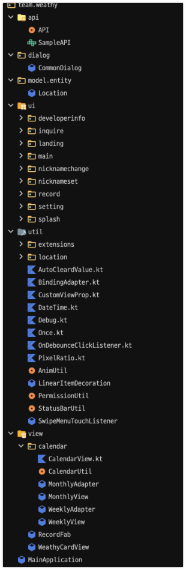

# WeathyAndroid
<!-- ALL-CONTRIBUTORS-BADGE:START - Do not remove or modify this section -->
[](#contributors-)
<!-- ALL-CONTRIBUTORS-BADGE:END -->

## 목차

- [기여자들](#기여자들-)
- [각자 맡은 부분 및 역할 작성](#각자-맡은-부분-및-역할-작성)
- [안드로이드 툴 세팅](#안드로이드-툴-세팅)
  - [Gradle 설정](#gradle-설정)
  - [코드 컨벤션](#코드-컨벤션)
  - [깃 사용전략](#git-사용-전략)
  - [깃허브 액션, 슬랙봇](#github-action--slack-bot)
- [사용 라이브러리 & 목적](#사용-라이브러리와-목적)
- [사용한 기술 스택](#사용한-기술-스택)
- [프로젝트 구조](#프로젝트-구조패키지-분류-이미지)
- [구현 화면](#구현-화면)
- [회의록](#회의록-주소)
- [핵심 기능 구현 방법 코드](#핵심-기능-구현-방법-코드)
- [특수 레이아웃](#특수-레이아웃)
- [도형 및 상태변환](#도형-및-상태변환)

## 기여자들 ✨

<!-- ALL-CONTRIBUTORS-LIST:START - Do not remove or modify this section -->
<!-- prettier-ignore-start -->
<!-- markdownlint-disable -->
<table>
  <tr>
    <td align="center"><a href="https://github.com/dingding-21"><br /><sub><b>dingding-21</b></sub></a><br /><a href="https://github.com/TeamWeathy/WeathyAndroid/commits?author=dingding-21" title="Code">💻</a></td>
    <td align="center"><a href="https://github.com/kmebin"><br /><sub><b>kmebin</b></sub></a><br /><a href="https://github.com/TeamWeathy/WeathyAndroid/commits?author=kmebin" title="Code">💻</a></td>
    <td align="center"><a href="https://www.mjstudio.net/"><br /><sub><b>MJ Studio</b></sub></a><br /><a href="https://github.com/TeamWeathy/WeathyAndroid/commits?author=mym0404" title="Code">💻</a></td>
  </tr>
</table>

<!-- markdownlint-enable -->
<!-- prettier-ignore-end -->
<!-- ALL-CONTRIBUTORS-LIST:END -->


## 각자 맡은 부분 및 역할 작성

명주: 스플래시 화면, 온보딩 화면, 닉네임 설정 화면, 홈 화면, 캘린더 화면, 날씨 검색 화면
희빈: 날씨 추가 시작 화면, 날씨 추가 옷 선택 화면, 날씨 추가 옷 삭제 화면, 커스텀 Dialog들, 날씨 추가 날씨 선택 화면, 날씨 추가 피드백 작성 화면
현지: 홈 화면, 설정 화면, 닉네임 변경 화면, 문의하기 화면, 개발자 정보 화면


- 스플래시: 명주



- 온보딩: 명주



- 닉네임 설정: 명주


- 홈: 현지, 명주
 


- 검색: 명주


- 캘린더: 명주


- 날씨 추가 시작: 희빈



- 날씨 추가 옷 선택


- 날씨 추가 옷 삭제


- 날씨 추가 날씨 선택



- 날씨 추가 피드백 작성



- 설정: 현지



- 닉네임 변경: 현지


- 팀 정보: 현지



## 안드로이드 툴 세팅

### Gradle 설정

- 컴파일 SDK 버전: `30`
- 빌드툴 버전: `29.0.3`
- 최소 SDK 버전: `23`
- 타겟 SDK 버전: `30`
- 릴리즈 빌드 설정
  - 안쓰는 리소스 제거: `true`
  - 코드 난독화 및 최적화: `true`
```groovy
release {
    signingConfig signingConfigs.release
    shrinkResources true
    minifyEnabled true
    proguardFiles getDefaultProguardFile('proguard-android-optimize.txt'), 'proguard-rules.pro'
}
```
- 컴파일 옵션
  - 자바 호환성 버전: `1.8`
  - 코어라이브러리 desugar: `true`
```groovy
compileOptions {
    sourceCompatibility JavaVersion.VERSION_1_8
    targetCompatibility JavaVersion.VERSION_1_8
    coreLibraryDesugaringEnabled true
}
```
- 코틀린 옵션
  - JVM 타겟 버전: `1.8`
```groovy
kotlinOptions {
    jvmTarget = '1.8'
}
```
- 빌드 기능 추가
  - 데이터 바인딩: `true`
  - 뷰 바인딩: `true`
```groovy
buildFeatures {
    dataBinding true
    viewBinding true
}
```
- 테스트 옵션
  - 유닛테스트 기본값 반환
  - 유닛테스트 안드로이드 리소스 포함(Reboletrics)
```groovy
testOptions {
    unitTests.returnDefaultValues = true
    unitTests {
        includeAndroidResources = true
    }
}
```
- 린트 옵션
  - abortOnError 비활성화
```groovy
lintOptions {
    abortOnError false
}
```

### 코드 컨벤션

- 안드로이드 스튜디오 [Preferences] - [Editor] - [Code Style] - [Kotlin] 에서 Kotlin style guide 를 적용하고 `Reformat with code` 로 코드 포매팅

- 인터넷에 코틀린을 사용하는 [스타일 가이드를 잘 정리해둔 글](https://medium.com/mj-studio/%EC%BD%94%ED%8B%80%EB%A6%B0-%EC%9D%B4%EB%A0%87%EA%B2%8C-%EC%9E%91%EC%84%B1%ED%95%98%EC%8B%9C%EB%A9%B4-%EB%90%A9%EB%8B%88%EB%8B%A4-94871a1fa646)을 우연히 발견해 이 글에서 여러가지를 배워서 사용

### git 사용 전략



#### main(default) 브랜치

- `main` 브랜치가 default 브랜치
- `main` 에의 직접적인 `push`를 지양
- force push 는 Github branch protection 으로 막아둠

#### 기능(feature) 추가 방식

1. 기능별로 브랜치를 로컬 저장소에서 생성
2. 로컬 저장소에서 작업이 완료되면 그 브랜치를 원격 저장소(`origin`) 으로 `push`
3. Pull Request 생성 및 팀원에게 공유
4. Pull Request 병합할 때 `Create merge commit` 옵션을 사용
5. Pull Request 가 병합되면(main에) 팀원들에게 새로운 기능이 `main` 에 추가되었으니 로컬 저장소에서 `pull` 을 해서 동기화 하라고 알려줌

### Github action & Slack Bot



- 깃허브 액션으로 `push`할 때마다, 자동으로 릴리즈 빌드가 되어 팀의 슬랙 채널에 apk 파일을 전달해줌

```yml
name: Android Build
on: [push]
defaults:
  run:
    shell: bash
    working-directory: .

jobs:
  build:
    runs-on: ubuntu-latest
    name: InstrumentationTest + Build
    if: "!contains(toJSON(github.event.commits.*.message), '[skip action]') && !startsWith(github.ref, 'refs/tags/')"
    steps:
      - name: Checkout repository
        uses: actions/checkout@v2
      - name: Gradle cache
        uses: actions/cache@v2
        with:
          path: |
            ~/.gradle/caches
            ~/.gradle/wrapper
          key: ${{ runner.os }}-gradle-${{ hashFiles('**/*.gradle*') }}
          restore-keys: |
            ${{ runner.os }}-gradle-

      #      - uses: actions/setup-java@v1
      #        with:
      #          java-version: '1.8'

      #      - name: Android Emulator Runner, Test
      #        uses: ReactiveCircus/android-emulator-runner@v2.14.2
      #        with:
      #          api-level: 29
      #          script: ./gradlew connectedCheck

      - name: Build Release
        if: ${{ contains(github.ref, 'main') }}
        run: ./gradlew assembleRelease
      - name: Build Debug
        if: ${{ !contains(github.ref, 'main') }}
        run: ./gradlew assembleDebug

      - name: Archive artifacts
        uses: actions/upload-artifact@v2
        with:
          path: app/build/outputs
      - name: Update Release apk name
        if: ${{ success() && contains(github.ref, 'main') }}
        run: |
          mv app/build/outputs/apk/release/app-release.apk 웨디-릴리즈.apk
          echo 'apk=웨디-릴리즈.apk' >> $GITHUB_ENV
      - name: Upload APK
        if: ${{ success() && contains(github.ref, 'main') }}
        run: |
          curl -X POST \
          -F file=@$apk \
          -F channels=${{secrets.SLACK_CHANNEL_ID}} \
          -H "Authorization: Bearer ${{secrets.SLACK_BOT_API_TOKEN}}" \
          https://slack.com/api/files.upload
      - name: On success, Notify with Slack
        if: ${{ success() && contains(github.ref, 'main') }}
        uses: rtCamp/action-slack-notify@master
        env:
          SLACK_WEBHOOK: ${{ secrets.SLACK_WEBHOOK_ANDROID }}
          SLACK_TITLE: '안드로이드 릴리즈 빌드 성공 ✅'
          MSG_MINIMAL: true
          SLACK_MESSAGE: 'apk가 생성되었습니다'
      - name: On fail, Notify with Slack
        if: ${{ failure() }}
        uses: rtCamp/action-slack-notify@master
        env:
          SLACK_WEBHOOK: ${{ secrets.SLACK_WEBHOOK_ANDROID }}
          SLACK_TITLE: '안드로이드 빌드 실패 ❌'
          MSG_MINIMAL: false
          SLACK_MESSAGE: '에러를 확인해주세요'
```

## 사용 라이브러리와 목적

- Glide: url 형태의 이미지를 다운받아 `ImageView`에 표시해주는 용도. 캐시도 자동으로 해줌
- Retrofit: `OkHttp3`를 내부적으로 사용하여 Rest API를 사용하게 해줄 수 있는 어노테이션 프로세서를 이용한 자바 라이브러리. 서버와의 통신에 사용
- Material Design Component: 구글이 개발한 매터리얼 디자인을 안드로이드에서 쉽게 사용할 수 있는 구현체들을 제공하는 라이브러리. UI에 적용
- SwipeRefreshLayout: 당겨서 리프레시 할 수 있는 레이아웃을 제공.
- AAC Lifecycle: LiveData, Lifecycle, ViewModel 등 안드로이드 생명주기와 연동된 컴포넌트들과 클래스들을 제공
- Kotlin Standard Library: 코틀린의 확장 클래스들을 제공해주고 컬렉션을 손쉽게 사용할 수 있게 해줌
- Jetpack Activity: 안드로이드의 `Activity`를 계속 발전시켜 새로운 기능들을 사용할 수 있게 해줌
- Jetpack Fragment: 안드로이드의 `Fragment`를 계속 발전시켜 새로운 기능들을 사용할 수 있게 해줌
- Jetpack Core KTX
- ConstraintLayout: `ConstraintLayout`을 사용하여 뷰들을 레이아웃에 손쉽게 배치해주게 해줌. 그리고 `MotionLayout`도 제공
- Dexter: 권한 허용을 쉽게 도와주는 라이브러리. 위치 권한 허용에 사용
- Google Mobile Service Location: 현재 위치를 받아오거나 지오코딩 하는데 사용
- Dynamic animation: Spring 물리를 이용한 애니메이션을 구현하는 데 사용
- Desugar JDK Library: `java.time` 패키지 유틸리티들을 사용하기 위한 desugaring에 사용
- Flipper: 디버깅에 사용
- Hilt: 의존성 주입에 사용
- Room: 로컬 데이터베이스, 최근 검색 위치 저장에 사용
- LoremIpsum: Mock 데이터 생성에 사용
- Lottie: 스플래시 애니메이션에 사용
- [Snowfall](https://github.com/JetradarMobile/android-snowfall) 코드 가져와서 수정해서 사용: 눈, 비 내리는 애니메이션


## 사용한 기술 스택

- AAC DataBinding, ViewModel
```kotlin
class MainActivity : AppCompatActivity() {
    private lateinit var binding: ActivityMainBinding
    private val viewModel by viewModels<MainViewModel>()

    override fun onCreate(savedInstanceState: Bundle?) {
        super.onCreate(savedInstanceState)

        binding = ActivityMainBinding.inflate(layoutInflater)
        binding.vm = viewModel
        binding.lifecycleOwner = this
        setContentView(binding.root)
        ...
    }
```
- 비동기 작업 - Coroutine
```kotlin
override fun onAttachedToWindow() {
    super.onAttachedToWindow()
    initialJob = GlobalScope.launch(Dispatchers.Main) {
        ...
    }
}

override fun onDetachedFromWindow() {
    super.onDetachedFromWindow()
    initialJob.cancel()
}
```
- 날짜 처리 - `java.time.LocalDate`, `java.util.Calendar`
  - Java 8의 패키지이기 때문에 사용하려면 desugaring을 해주어야 함
```kotlin
fun convertMonthlyIndexToDateToFirstDateOfMonthCalendar(index: Int): Pair<LocalDate, LocalDate> {
    val cur = LocalDate.now()

    val diffMonth = MonthlyAdapter.MAX_ITEM_COUNT - index - 1
    val monthSubtracted = cur.minusMonths(diffMonth.toLong())
    val firstDateOfMonth = monthSubtracted.withDayOfMonth(1)
    val startIdx = firstDateOfMonth.dayOfWeekIndex

    return firstDateOfMonth.minusDays(startIdx.toLong()) to firstDateOfMonth
}
```


## 프로젝트 구조(패키지 분류 이미지)



## 구현 화면

### TODO

## 회의록 주소

[회의록 위키 홈](https://github.com/TeamWeathy/WeathyAndroid/wiki)

## 핵심 기능 구현 방법 코드

- 현재 위치 받아오기 (`LocationService`, `FusedLocationProviderClient`, `Geocoder`)
***LocationUtil.kt***
```kotlin
@SuppressLint("MissingPermission")
class LocationUtil @Inject constructor(app: Application, private val spUtil: SPUtil) : DefaultLifecycleObserver {
    private val locationManager = app.getSystemService(LocationManager::class.java)

    private val _lastLocation = MutableStateFlow<Location?>(null)
    val lastLocation: StateFlow<Location?> = _lastLocation

    private val _isOtherPlaceSelected: MutableStateFlow<Boolean> = MutableStateFlow(false)
    val isOtherPlaceSelected: StateFlow<Boolean> = _isOtherPlaceSelected

    val selectedWeatherLocation: MutableStateFlow<OverviewWeather?> = MutableStateFlow(null)

    private var isRegistered = false

    override fun onCreate(owner: LifecycleOwner) {
        registerLocationListener()

        _isOtherPlaceSelected.value = spUtil.isOtherPlaceSelected
    }

    override fun onDestroy(owner: LifecycleOwner) {
        unregisterLocationListener()
    }

    private val locationListener = object : LocationListener {
        override fun onLocationChanged(location: Location) {
            _lastLocation.value = location
        }

        override fun onStatusChanged(provider: String?, status: Int, extras: Bundle?) {
        }

        override fun onProviderEnabled(provider: String) {
        }

        override fun onProviderDisabled(provider: String) {
        }
    }

    fun registerLocationListener() {
        if (isRegistered) return

        debugE("registerLocationListener")
        try {
            _lastLocation.value = locationManager.getLastKnownLocation(LocationManager.GPS_PROVIDER)

            val enabledProviders = locationManager.allProviders.filter {
                locationManager.isProviderEnabled(it)
            }
            val provider =
                if (LocationManager.GPS_PROVIDER in enabledProviders) LocationManager.GPS_PROVIDER else enabledProviders.first()

            locationManager.requestLocationUpdates(provider, 1000, 1f, locationListener)
            isRegistered = true
        } catch (e: Throwable) {
            debugE(e)
        }
    }

    private fun unregisterLocationListener() {
        debugE("unregisterLocationListener")

        locationManager.removeUpdates(locationListener)
        isRegistered = false
    }

    fun selectPlace(weather: OverviewWeather) {
        spUtil.lastSelectedLocationCode = weather.region.code
        selectedWeatherLocation.value = weather
        spUtil.isOtherPlaceSelected = false
        _isOtherPlaceSelected.value = false
    }

    fun selectOtherPlace(weather: OverviewWeather) {
        spUtil.lastSelectedLocationCode = weather.region.code
        selectedWeatherLocation.value = weather
        spUtil.isOtherPlaceSelected = true
        _isOtherPlaceSelected.value = true
    }
}
```

- 커스텀 뷰(`WeathyCardView`)
***WeathyCardView.kt***
```kotlin
class WeathyCardView @JvmOverloads constructor(context: Context, attrs: AttributeSet? = null) :
    FrameLayout(context, attrs) {
    private val defaultShadowColor = Color.BLACK

    var radius by OnChangeProp(35.dpFloat) {
        updateUI()
    }
    var shadowColor by OnChangeProp(defaultShadowColor) {
        updateUI()
    }
    var disableShadow by OnChangeProp(false) {
        updateUI()
    }
    var strokeColor by OnChangeProp(Color.TRANSPARENT) {
        updateUI()
    }
    var strokeWidth by OnChangeProp(0f) {
        updateUI()
    }
    var cardBackgroundColor by OnChangeProp(Color.WHITE) {
        updateUI()
    }

    init {
        if (attrs != null) {
            getStyleableAttrs(attrs)
        }
        elevation = if (disableShadow) 0f else px(8).toFloat()
        updateUI()
    }

    private fun getStyleableAttrs(attr: AttributeSet) {
        context.theme.obtainStyledAttributes(attr, R.styleable.WeathyCardView, 0, 0).use { arr ->
            radius = arr.getDimension(R.styleable.WeathyCardView_weathy_radius, 35.dpFloat)
            shadowColor = arr.getColor(R.styleable.WeathyCardView_weathy_shadow_color, defaultShadowColor)
            disableShadow = arr.getBoolean(R.styleable.WeathyCardView_weathy_disable_shadow, false)
            strokeColor = arr.getColor(R.styleable.WeathyCardView_weathy_stroke_color, Color.TRANSPARENT)
            strokeWidth = arr.getDimension(R.styleable.WeathyCardView_weathy_stroke_width, 0f)
            cardBackgroundColor = arr.getColor(R.styleable.WeathyCardView_weathy_background_color, Color.WHITE)
        }
    }

    private fun updateUI() {
        background = MaterialShapeDrawable(ShapeAppearanceModel().withCornerSize(radius)).apply {
            fillColor = ColorStateList.valueOf(cardBackgroundColor)
            strokeWidth = this@WeathyCardView.strokeWidth
            strokeColor = ColorStateList.valueOf(this@WeathyCardView.strokeColor)
        }
        setShadowColorIfAvailable(shadowColor)
    }
}
```

```xml
<team.weathy.view.calendar.CalendarView
    curDate="@={vm.curDate}"
    android:id="@+id/calendarView"
    android:layout_width="match_parent"
    android:layout_height="220dp"
    app:layout_constraintTop_toTopOf="parent" />
```

- 캘린더 뷰(`CalendarView`)
***CalendarView.kt***
```kotlin
class CalendarView @JvmOverloads constructor(context: Context, attrs: AttributeSet? = null) :
    ConstraintLayout(context, attrs) {
    private val today = LocalDate.now()

    var onDateChangeListener: ((date: LocalDate) -> Unit)? = null
    var onSelectedDateChangeListener: ((date: LocalDate) -> Unit)? = null

    private val curDateLiveData = MutableLiveData(LocalDate.now())
    var curDate: LocalDate by OnChangeProp(LocalDate.now()) {
         onCurDateChanged()
    }

    private val selectedDateLiveData = MutableLiveData(LocalDate.now())
    var selectedDate: LocalDate by OnChangeProp(LocalDate.now()) {
        selectedDateLiveData.value = it
        onSelectedDateChangeListener?.invoke(it)
        curDate = it
        invalidate()
    }
    private var rowCount = 4

    private val dataLiveData = MutableLiveData<Map<YearMonthFormat, List<CalendarPreview?>>>(mapOf())
    var data: Map<YearMonthFormat, List<CalendarPreview?>> by OnChangeProp(mapOf()) {
        dataLiveData.value = it
    }

    var onClickYearMonthText: (() -> Unit)? = null

    private val isTodayInCurrentMonth
        get() = curDate.year == today.year && curDate.month == today.month
    private val isTodayInCurrentWeek
        get() = isTodayInCurrentMonth && curDate.weekOfMonth == today.weekOfMonth
    private val isSelectedInCurrentWeek
        get() = selectedDate.year == curDate.year && selectedDate.month == curDate.month && selectedDate.weekOfMonth == curDate.weekOfMonth


    private val animLiveData = MutableLiveData(0f)
    private var animValue by OnChangeProp(0f) {
        animLiveData.value = it
        onAnimValueChanged()
    }

    private val scrollEnabled = MutableLiveData(false)
    private val onScrollToTop = SimpleEventLiveData()

    private val collapsedHeight
        get() = px(MIN_HEIGHT_DP)
    private val expandedHeight
        get() = screenHeight - px(EXPAND_MARGIN_BOTTOM_DP)

    private val paddingHorizontal = px(24)

    private val yearMonthText = TextView(context).apply {
        id = ViewCompat.generateViewId()
        setTextSize(TypedValue.COMPLEX_UNIT_DIP, 25f)
        if (!isInEditMode) typeface = ResourcesCompat.getFont(context, R.font.roboto_medium)
        setTextColor(getColor(R.color.main_grey))
        gravity = Gravity.CENTER
        stateListAnimator = AnimatorInflater.loadStateListAnimator(context, R.animator.pressed_alpha_state_list_anim)

        layoutParams = LayoutParams(WRAP_CONTENT, WRAP_CONTENT).apply {
            topToTop = parentId
            leftToLeft = parentId
            rightToRight = parentId
            topMargin = px(26)
        }
        setOnDebounceClickListener {
            onClickYearMonthText?.invoke()
        }
    }

    private val downArrow = ImageView(context).apply {
        id = ViewCompat.generateViewId()
        setImageResource(R.drawable.calendar_btn_arrow)
        scaleType = FIT_CENTER
        layoutParams = LayoutParams(WRAP_CONTENT, WRAP_CONTENT).apply {
            topToTop = yearMonthText.id
            bottomToBottom = yearMonthText.id
            leftToRight = yearMonthText.id
            leftMargin = 4.dp
        }
    }

    private val todayButton = ImageButton(context).apply {
        setImageResource(R.drawable.ic_today)
        scaleType = FIT_CENTER

        val outValue = TypedValue()
        context.theme.resolveAttribute(attr.selectableItemBackgroundBorderless, outValue, true)
        setBackgroundResource(outValue.resourceId)

        setOnDebounceClickListener {
            curDate = today
            selectedDate = today
        }

        layoutParams = LayoutParams(px(32), px(32)).apply {
            setPadding(px(6), px(6), px(6), px(6))
            topToTop = yearMonthText.id
            bottomToBottom = yearMonthText.id
            rightToRight = parentId
            rightMargin = px(0)
        }
    }

    private val topDivider = View(context).apply {
        id = ViewCompat.generateViewId()
        setBackgroundColor(getColor(R.color.sub_grey_5))

        layoutParams = LayoutParams(MATCH_PARENT, px(1)).apply {
            topToBottom = yearMonthText.id
            topMargin = px(11)
        }
    }

    private val weekTextLayout = LinearLayout(context).apply {
        id = ViewCompat.generateViewId()
        orientation = LinearLayout.HORIZONTAL
        weightSum = 7f

        layoutParams = LayoutParams(MATCH_PARENT, WRAP_CONTENT).apply {
            topToBottom = topDivider.id
            topMargin = px(16)
        }
    }
    private val weekTexts = (0..6).map {
        TextView(context).apply {
            id = ViewCompat.generateViewId()
            setTextSize(TypedValue.COMPLEX_UNIT_DIP, 13f)
            text = listOf("일", "월", "화", "수", "목", "금", "토")[it]
            gravity = Gravity.CENTER

            layoutParams = LinearLayout.LayoutParams(MATCH_PARENT, WRAP_CONTENT, 1f)
        }
    }

    private var isExpanded = false
    private fun expand() {
        isExpanded = true
        notifyEnableScroll()
        enableTouchMonthlyPagerOnly()

        springAnim = AnimUtil.runSpringAnimation(animValue * 500f, 500f) {
            animValue = it / 500f
        }

        onExpandedChange()
    }

    private fun collapse() {
        isExpanded = false
        notifyDisableScroll()
        enableTouchWeeklyPagerOnly()

        springAnim = AnimUtil.runSpringAnimation(animValue * 500f, 0f) {
            animValue = it / 500f
        }

        onExpandedChange()
    }

    private fun onExpandedChange() {
        notifyScrollToTop()
        invalidate()
    }

    private val fragmentViewLifecycleOwner
        get() = findFragment<Fragment>().viewLifecycleOwner

    private val monthlyViewPagerGenerator = {
        ViewPager2(context).apply {
            layoutParams = LayoutParams(MATCH_PARENT, 0).apply {
                topToBottom = weekTextLayout.id
                bottomToBottom = parentId
                bottomMargin = px(32)
            }

            adapter = MonthlyAdapter(
                animLiveData,
                scrollEnabled,
                onScrollToTop,
                dataLiveData,
                selectedDateLiveData,
                fragmentViewLifecycleOwner,
            ) {
                if (!it.isFuture()) selectedDate = it
            }
            setCurrentItem(MonthlyAdapter.MAX_ITEM_COUNT, false)
            alpha = 0f

            setPageTransformer { page, position ->
                page.pivotX = if (position < 0) page.width.toFloat() else 0f
                page.pivotY = page.height * 0.5f
                page.rotationY = 25f * position
            }

            registerOnPageChangeCallback(object : OnPageChangeCallback() {
                override fun onPageSelected(position: Int) {
                    val (_, firstDateOfMonth) = convertMonthlyIndexToDateToFirstDateOfMonthCalendar(
                        position
                    )
                    if (isExpanded && curDate != firstDateOfMonth) {
                        curDate = firstDateOfMonth
                    }
                }
            })

            offscreenPageLimit = 1
        }
    }
    private var monthlyViewPager: ViewPager2? = null
    private val weeklyViewPagerGenerator = {
        ViewPager2(context).apply {
            layoutParams = LayoutParams(MATCH_PARENT, 0).apply {
                topToBottom = weekTextLayout.id
                height = px(WeeklyView.ITEM_HEIGHT_DP)
            }

            adapter = WeeklyAdapter(animLiveData, dataLiveData, fragmentViewLifecycleOwner) {
                if (!it.isFuture()) selectedDate = it
            }
            setCurrentItem(WeeklyAdapter.MAX_ITEM_COUNT, false)

            setPageTransformer { page, position ->
                page.pivotX = if (position < 0) page.width.toFloat() else 0f
                page.pivotY = page.height * 0.5f
                page.rotationY = 40f * position
            }

            registerOnPageChangeCallback(object : OnPageChangeCallback() {
                override fun onPageSelected(position: Int) {
                    val newDate = convertWeeklyIndexToFirstDateOfWeekCalendar(position)
                    if (!isExpanded && curDate != newDate) {
                        curDate = newDate
                    }
                }
            })

            offscreenPageLimit = 1
        }
    }
    private var weeklyViewPager: ViewPager2? = null

    init {
        initContainer()
        addViews()
        configureExpandGestureHandling()
        enableTouchWeeklyPagerOnly()
        changeWeekTextsColor()
        onCurDateChanged()
    }


    private val scope = CoroutineScope(Job() + Dispatchers.Main)
    private lateinit var lazyPagerAddJob: Job
    override fun onAttachedToWindow() {
        super.onAttachedToWindow()
        lazyPagerAddJob = scope.launch {
            if (weeklyViewPager == null) {
                weeklyViewPager = weeklyViewPagerGenerator()
                TransitionManager.beginDelayedTransition(this@CalendarView)
                addView(weeklyViewPager!!, 0)
            }
            delay(400)
            if (monthlyViewPager == null) {
                monthlyViewPager = monthlyViewPagerGenerator()
                addView(monthlyViewPager!!, 0)
            }
        }
    }

    override fun onDetachedFromWindow() {
        super.onDetachedFromWindow()
        lazyPagerAddJob.cancel()
    }

    private fun initContainer() {
        setPadding(paddingHorizontal, 0, paddingHorizontal, 0)

        background = MaterialShapeDrawable(
            ShapeAppearanceModel().toBuilder().setBottomLeftCorner(CornerFamily.ROUNDED, px(35).toFloat())
                .setBottomRightCorner(CornerFamily.ROUNDED, px(35).toFloat()).build()
        ).apply {
            fillColor = ColorStateList.valueOf(getColor(R.color.white))
        }
        elevation = px(4).toFloat()
    }

    private fun addViews() {
        addView(yearMonthText)
        addView(downArrow)
        addView(todayButton)
        addView(topDivider)
        addWeekLayoutAndWeekTexts()
    }

    private fun addWeekLayoutAndWeekTexts() = weekTextLayout.also { layout ->
        addView(layout)
        weekTexts.forEach(layout::addView)
    }

    private fun onCurDateChanged() {
        curDateLiveData.value = curDate
        rowCount = calculateRequiredRow(curDate)

        setYearMonthTextWithDate(curDate)
        selectPagerItemsWithDate(curDate)

        onDateChangeListener?.invoke(curDate)
        changeWeekTextsColor()
        notifyScrollToTop()
        invalidate()
    }

    private fun setYearMonthTextWithDate(date: LocalDate) {
        yearMonthText.text = "${date.year} .${date.monthValue}"
    }

    private fun selectPagerItemsWithDate(date: LocalDate) {
        val nextMonthlyIndex = convertDateToMonthlyIndex(date)
        val nextWeeklyIndex = convertDateToWeeklyIndex(date)

        if (monthlyViewPager?.currentItem != nextMonthlyIndex) {
            monthlyViewPager?.setCurrentItem(
                nextMonthlyIndex, false
            )
        }

        if (weeklyViewPager?.currentItem != nextWeeklyIndex) {
            weeklyViewPager?.setCurrentItem(
                nextWeeklyIndex, false
            )
        }
    }


    private val barPaint = Paint(Paint.ANTI_ALIAS_FLAG).apply {
        color = getColor(R.color.main_mint)
    }
    private val greyCapsulePaint = Paint(Paint.ANTI_ALIAS_FLAG).apply {
        color = getColor(R.color.sub_grey_5)
        setShadowLayer(12f, 0f, 0f, getColor(R.color.sub_grey_5))
    }
    private val capsulePaint = Paint(Paint.ANTI_ALIAS_FLAG).apply {
        color = getColor(R.color.main_mint)
        setShadowLayer(12f, 0f, 0f, getColor(R.color.main_mint))
    }

    override fun onDraw(canvas: Canvas) {
        // bar
        canvas.drawRoundRect(
            width / 2f - px(30),
            height - pxFloat(16),
            width / 2f + px(30),
            height - pxFloat(11),
            pxFloat(10),
            pxFloat(10),
            barPaint,
        )

        // capsule
        val widthWithoutPadding = width - paddingHorizontal * 2f
        val rawWidth = widthWithoutPadding / 7f
        val maxWidth = pxFloat(42)
        val capsuleWidth = rawWidth.coerceAtMost(maxWidth)
        val capsuleLeftPadding = if (rawWidth >= maxWidth) (rawWidth - maxWidth) / 2f else 0f
        val capsuleHeight = pxFloat(64)
        val capsuleLeft = paddingHorizontal + capsuleLeftPadding + today.dayOfWeekIndex * rawWidth
        val capsuleWidthRadius = capsuleWidth / 2f
        val capsuleTop = pxFloat(72)

        val greyCapsuleLeft = paddingHorizontal + capsuleLeftPadding + selectedDate.dayOfWeekIndex * rawWidth
        if (isSelectedInCurrentWeek) {
            canvas.drawRoundRect(
                greyCapsuleLeft,
                capsuleTop,
                greyCapsuleLeft + capsuleWidth,
                capsuleTop + capsuleHeight,
                capsuleWidthRadius,
                capsuleWidthRadius,
                greyCapsulePaint
            )
        }

        if (isTodayInCurrentWeek) {
            canvas.drawRoundRect(
                capsuleLeft,
                capsuleTop,
                capsuleLeft + capsuleWidth,
                capsuleTop + capsuleHeight,
                capsuleWidthRadius,
                capsuleWidthRadius,
                capsulePaint,
            )
        }
    }

    private var springAnim: SpringAnimation? = null
    private var tracker: VelocityTracker? = null

    @SuppressLint("Recycle")
    private fun configureExpandGestureHandling() {
        setOnTouchListener { view, event ->
            when (event.actionMasked) {
                MotionEvent.ACTION_DOWN -> {
                    if (event.y <= view.height - px(30)) {
                        return@setOnTouchListener false
                    }

                    springAnim?.cancel()

                    tracker?.clear()
                    tracker = tracker ?: VelocityTracker.obtain()
                    tracker?.addMovement(event)
                }
                MotionEvent.ACTION_MOVE -> {
                    tracker?.apply {
                        addMovement(event)
                        computeCurrentVelocity(1000)
                    }

                    animValue = ((event.y - collapsedHeight) / (expandedHeight - collapsedHeight)).clamp(0f, 1.2f)
                }
                MotionEvent.ACTION_UP, MotionEvent.ACTION_CANCEL -> {
                    if (tracker!!.yVelocity > 0) expand()
                    else collapse()

                    tracker?.also {
                        it.recycle()
                        tracker = null
                    }
                }
            }
            true
        }
    }

    private fun onAnimValueChanged() {
        animateHeight()
        changeWeekTextsColor()
        animCapsulePaintAlpha()
        animPagersAlpha()
    }

    private fun animateHeight() = updateLayoutParams<ViewGroup.LayoutParams> {
        height = MathUtils.lerp(collapsedHeight.toFloat(), expandedHeight.toFloat(), animValue).toInt()
    }

    private fun changeWeekTextsColor() {
        weekTexts.forEachIndexed { idx, textView ->
            textView.setTextColor(
                CalendarUtil.getWeekTextColor(
                    context, idx, animValue, isTodayInCurrentWeek && today.dayOfWeekIndex == idx
                )
            )
        }
    }


    private fun animCapsulePaintAlpha() {
        capsulePaint.alpha = (255 - animValue * 255).toInt().clamp(0, 255)
        greyCapsulePaint.alpha = (255 - animValue * 255).toInt().clamp(0, 255)
    }

    private fun animPagersAlpha() {
        weeklyViewPager?.alpha = 1 - animValue
        monthlyViewPager?.alpha = animValue
    }

    private fun notifyDisableScroll() {
        scrollEnabled.value = false
    }

    private fun notifyEnableScroll() {
        scrollEnabled.value = true
    }

    private fun notifyScrollToTop() {
        onScrollToTop.emit()
    }

    private fun enableTouchWeeklyPagerOnly() {
        weeklyViewPager?.isUserInputEnabled = true
        monthlyViewPager?.isUserInputEnabled = false

        if (weeklyViewPager != null && monthlyViewPager != null) {
            removeViewAt(0)
            removeViewAt(0)
            addView(monthlyViewPager, 0)
            addView(weeklyViewPager, 1)
        }
    }

    private fun enableTouchMonthlyPagerOnly() {
        weeklyViewPager?.isUserInputEnabled = false
        monthlyViewPager?.isUserInputEnabled = true

        if (weeklyViewPager != null && monthlyViewPager != null) {
            removeViewAt(0)
            removeViewAt(0)
            addView(weeklyViewPager, 0)
            addView(monthlyViewPager, 1)
        }
    }

    companion object {
        private const val parentId = ConstraintSet.PARENT_ID
        private const val MIN_HEIGHT_DP = 224
        private const val EXPAND_MARGIN_BOTTOM_DP = 120
    }
}
```

- 날짜 계산 유틸리티
***DateTime.kt***
```kotlin
fun convertMonthlyIndexToDateToFirstDateOfMonthCalendar(index: Int): Pair<LocalDate, LocalDate> {
    val cur = LocalDate.now()

    val diffMonth = MonthlyAdapter.MAX_ITEM_COUNT - index - 1
    val monthSubtracted = cur.minusMonths(diffMonth.toLong())
    val firstDateOfMonth = monthSubtracted.withDayOfMonth(1)
    val startIdx = firstDateOfMonth.dayOfWeekIndex

    return firstDateOfMonth.minusDays(startIdx.toLong()) to firstDateOfMonth
}

fun convertWeeklyIndexToFirstDateOfWeekCalendar(index: Int): LocalDate {
    val cur = LocalDate.now()

    val diffWeek = WeeklyAdapter.MAX_ITEM_COUNT - index - 1
    val weekSubtracted = cur.minusWeeks(diffWeek.toLong())
    val startIdx = weekSubtracted.dayOfWeekIndex

    return weekSubtracted.minusDays(startIdx.toLong())
}

fun convertDateToMonthlyIndex(date: LocalDate): Int {
    val now = LocalDate.now()

    val yearDiff = now.year - date.year
    val diffIndex = now.monthValue - date.monthValue + yearDiff * 12

    return MonthlyAdapter.MAX_ITEM_COUNT - diffIndex - 1
}

fun convertDateToWeeklyIndex(date: LocalDate): Int {
    val now = LocalDate.now()
    val nowDayOfWeekIndex = now.dayOfWeekIndex
    val nowFirstDayOfWeek = now.minusDays(nowDayOfWeekIndex.toLong())

    val dateDayOfWeekIndex = date.dayOfWeekIndex
    val dateFirstDayOfWeek = date.minusDays(dateDayOfWeekIndex.toLong())

    val weekDiff = dateFirstDayOfWeek.until(nowFirstDayOfWeek, ChronoUnit.WEEKS).toInt()

    return WeeklyAdapter.MAX_ITEM_COUNT - weekDiff - 1
}


fun calculateRequiredRow(date: LocalDate): Int {
    return (date.lengthOfMonth() + date.withDayOfMonth(1).dayOfWeekIndex - 1) / 7 + 1
}

fun getStartDateStringInCalendar(year: Int, month: Int): DateString {
    val date = LocalDate.of(year, month, 1)
    val startDayIndex = date.dayOfWeekIndex

    val startDateInCalendar = date.minusDays(startDayIndex.toLong())
    return startDateInCalendar.dateString
}

fun getEndDateStringInCalendar(year: Int, month: Int): DateString {
    val firstDate = LocalDate.of(year, month, 1)
    val lastDate = LocalDate.of(year, month, firstDate.lengthOfMonth())
    val endDayIndex = lastDate.dayOfWeekIndex

    val endDateInCalendar = lastDate.plusDays(6 - endDayIndex.toLong())
    return endDateInCalendar.dateString
}
```

- 권한 허용 유틸리티
***PermissionUtil.kt***
```kotlin
/**
 * Dexter를 이용한 권한 요청 및 콜백에 관련된 유틸
 *
 * @author MJStudio
 * @see android.Manifest.permission
 */
object PermissionUtil {
    fun requestLocationPermissions(activity: Activity, listener: PermissionListener) {
        requestPermissions(
            activity, listOf(
                android.Manifest.permission.ACCESS_COARSE_LOCATION,
                android.Manifest.permission.ACCESS_FINE_LOCATION,
            ), listener
        )
    }

    /**
     * 권한들이 허용되었는지 검사를 요청하는 함수
     *
     * @param activity Dexter 라이브러리가 사용할 Activity 객체
     * @param listener 권한들에 대한 검사가 완료되었을 때 콜백을 처리할 리스너
     * @param permissions 요청하는 권한 목록 [android.Manifest.permission]
     */
    private fun requestPermissions(activity: Activity, permissions: Collection<String>, listener: PermissionListener) {

        val callbackListener: MultiplePermissionsListener = object : BaseMultiplePermissionsListener() {

            override fun onPermissionsChecked(report: MultiplePermissionsReport) {

                val deniedPermissions = report.deniedPermissionResponses.map { it.permissionName }
                val permanentlyDeniedPermissions =
                    report.deniedPermissionResponses.filter { it.isPermanentlyDenied }.map { it.permissionName }

                // 모든 권한이 허가되었다면,
                when {
                    report.areAllPermissionsGranted() -> {
                        listener.onPermissionGranted()
                    }
                    // 권한 중에 영구적으로 거부된 권한이 있다면
                    report.isAnyPermissionPermanentlyDenied -> {
                        listener.onAnyPermissionsPermanentlyDeined(deniedPermissions, permanentlyDeniedPermissions)
                    }
                    // 권한 중에 거부된 권한이 있다면
                    else -> {
                        listener.onPermissionShouldBeGranted(deniedPermissions)
                    }
                }
            }

        }

        /**
         * Dexter로 activity를 이용한 권한 요청
         */
        Dexter.withActivity(activity).withPermissions(permissions).withListener(callbackListener).check()
    }


    fun openPermissionSettings(context: Context) {
        context.startActivity(Intent(Settings.ACTION_APPLICATION_DETAILS_SETTINGS).apply {
            data = Uri.fromParts("package", context.packageName, null)
        })
    }

    interface PermissionListener {
        /**
         * 모든 권한이 허용되었다.
         */
        fun onPermissionGranted() {}

        /**
         * 일부 권한이 거부되었다.
         *
         * @param deniedPermissions 거부된 권한 목록
         */
        fun onPermissionShouldBeGranted(deniedPermissions: List<String>) {}

        /**
         * 일부 권한이 영구적으로 거부되었다.
         *
         * @param deniedPermissions 거부된 권한 목록
         * @param permanentDeniedPermissions 영구적으로 거부된 권한 목록
         */
        fun onAnyPermissionsPermanentlyDeined(
            deniedPermissions: List<String>, permanentDeniedPermissions: List<String>
        ) {
        }
    }
}
```

- StatusBar 상태 조절 유틸리티
***StatusBarUtil.kt***
```kotlin
@Suppress("DEPRECATION")
object StatusBarUtil {
    fun changeColor(activity: Activity, @ColorInt color: Int) {
        activity.window?.run {
            statusBarColor = color
        }
    }
}
```

- Dagger mock api module
***ApiModule.kt***
```kotlin
@Qualifier
@Retention(BINARY)
annotation class Api

@Qualifier
@Retention(BINARY)
annotation class ApiMock

@Module
@InstallIn(ApplicationComponent::class)
class ApiModule {
    @Provides
    @Singleton
    fun provideRetrofitProvider(uniqueId: UniqueIdentifier) = ApiFactory(uniqueId)

    @Provides
    @Singleton
    @Api
    fun provideAuth(provider: ApiFactory) = provider.createApi(AuthAPI::class)

    @Provides
    @Singleton
    @Api
    fun provideCalendar(provider: ApiFactory) = provider.createApi(CalendarAPI::class)

    @Provides
    @Singleton
    @Api
    fun provideClothes(provider: ApiFactory) = provider.createApi(ClothesAPI::class)

    @Provides
    @Singleton
    @Api
    fun provideUser(provider: ApiFactory) = provider.createApi(UserAPI::class)

    @Provides
    @Singleton
    @Api
    fun provideWeather(provider: ApiFactory) = provider.createApi(WeatherAPI::class)

    @Provides
    @Singleton
    @Api
    fun provideWeahy(provider: ApiFactory) = provider.createApi(WeathyAPI::class)
}

@Module
@InstallIn(ApplicationComponent::class)
abstract class ApiModuleMock {
    @Singleton
    @Binds
    @ApiMock
    abstract fun bindUser(api: MockUserAPI): UserAPI

    @Singleton
    @Binds
    @ApiMock
    abstract fun bindCalendar(api: MockCalendarAPI): CalendarAPI

    @Singleton
    @Binds
    @ApiMock
    abstract fun bindWeather(api: MockWeatherAPI): WeatherAPI

    @Singleton
    @Binds
    @ApiMock
    abstract fun bindWeathy(api: MockWeathyAPI): WeathyAPI
}
```

- CommonDialog 공통된 다이얼로그 `DialogFragment`
```kotlin
@AndroidEntryPoint
class CommonDialog : DialogFragment() {
    private var binding by AutoClearedValue<DialogCommonBinding>()

    @Inject
    lateinit var pixelRatio: PixelRatio

    private val title: String
        get() = arguments?.getString("title") ?: ""
    private val body: String
        get() = arguments?.getString("body") ?: ""
    private val btnText: String
        get() = arguments?.getString("btnText") ?: ""
    private val color: Int
        get() = arguments?.getInt("color", getColor(R.color.blue_temp)) ?: getColor(R.color.blue_temp)
    private val showCancel: Boolean
        get() = arguments?.getBoolean("showCancel") ?: false
    private val clickListener: ClickListener?
        get() = if (parentFragment == null) (activity as? ClickListener) else (parentFragment as? ClickListener)

    override fun onCreateView(inflater: LayoutInflater, container: ViewGroup?, savedInstanceState: Bundle?) =
        DialogCommonBinding.inflate(inflater, container, false).also {
            binding = it
        }.root

    override fun onViewCreated(view: View, savedInstanceState: Bundle?) {
        isCancelable = false
        binding.title.text = title
        binding.body.text = body
        binding.btn.text = btnText
        binding.btn setOnDebounceClickListener {
            clickListener?.onClickYes()
            dismiss()
        }
        binding.title.setTextColor(color)
        binding.btn.backgroundTintList = ColorStateList.valueOf(color)

        if (showCancel) {
            binding.btn.updateLayoutParams<ConstraintLayout.LayoutParams> {
                leftMargin = 13.dp
            }
            binding.btnCancel.isVisible = true
            binding.btnCancel setOnDebounceClickListener {
                clickListener?.onClickNo()
                dismiss()
            }
        }
    }

    override fun onResume() {
        super.onResume()

        val width = (pixelRatio.screenShort * 0.88f).coerceAtMost(pixelRatio.toPixel(309).toFloat())
        dialog?.window?.run {
            setBackgroundDrawable(ColorDrawable(Color.TRANSPARENT))
            setDimAmount(0.2f)
            setLayout(width.roundToInt(), WRAP_CONTENT)
        }
    }

    interface ClickListener {
        fun onClickYes() {}
        fun onClickNo() {}
    }

    companion object {
        fun newInstance(
            title: String? = null,
            body: String? = null,
            btnText: String? = null,
            color: Int? = null,
            showCancel: Boolean = false
        ) = CommonDialog().apply {
            arguments = bundleOf(
                "title" to title, "body" to body, "btnText" to btnText, "color" to color, "showCancel" to showCancel
            )
        }
    }
}
```

- EventLiveData
```kotlin
typealias SimpleEventLiveData = EventLiveData<Unit>
## 특수 레이아웃

class EventLiveData<T> : LiveData<T>() {
    private val pending = AtomicBoolean(false)

    override fun observe(owner: LifecycleOwner, observer: Observer<in T>) {
        super.observe(owner) {
            if (pending.compareAndSet(true, false)) {
                observer.onChanged(it)
            }
        }
    }

    @MainThread
    fun emit(value: T) {
        pending.set(true)
        setValue(value)
    }
}

fun SimpleEventLiveData.emit() {
    emit(Unit)
}
```

- AppEvent

```kotlin
fun SimpleSharedFlow() = MutableSharedFlow<Unit>(1, 0, DROP_OLDEST)
fun MutableSharedFlow<Unit>.emit() = tryEmit(Unit)

object AppEvent {
    val onWeathyUpdated = SimpleSharedFlow()
}
```

## 특수 레이아웃

- `WeathyCardView.kt` 같은 곳에서 단순하게 frame에 표현할 수 있을 때 `FrameLayout` 사용 [링크](https://github.com/TeamWeathy/WeathyAndroid/blob/main/app/src/main/java/team/weathy/view/WeathyCardView.kt)

- `fragment_home.xml` 에서 MotionLayout 사용 (메인 애니메이션 구현 위함) 

[링크](https://github.com/TeamWeathy/WeathyAndroid/blob/main/app/src/main/res/layout/fragment_home.xml)

[모션파일 링크](https://github.com/TeamWeathy/WeathyAndroid/blob/main/app/src/main/res/xml/home_motion.xml)

```xml
 <androidx.constraintlayout.motion.widget.MotionLayout
            android:id="@+id/container"
            android:layout_width="match_parent"
            android:layout_height="match_parent"
            android:clipChildren="false"
            android:clipToPadding="false"
            app:layoutDescription="@xml/home_motion">

            <androidx.constraintlayout.widget.Guideline
                android:id="@+id/guide_left"
                android:layout_width="wrap_content"
                android:layout_height="wrap_content"
                android:orientation="vertical"
                app:layout_constraintGuide_begin="26dp" />

            <androidx.constraintlayout.widget.Guideline
                android:id="@+id/guide_right"
                android:layout_width="wrap_content"
                android:layout_height="wrap_content"
                android:orientation="vertical"
                app:layout_constraintGuide_end="26dp" />

            <ImageView
                android:id="@+id/topBlur"
                android:layout_width="match_parent"
                android:layout_height="78dp"
                android:elevation="9dp"
                android:outlineProvider="none"
                android:scaleType="fitXY"
                srcResource="@{vm.weatherSecondBackground}"
                app:layout_constraintTop_toTopOf="parent" />
   ......
```

## 도형 및 상태변환

- `WeathyCardView` 에서 `MaterialShapeDrawable` 와 `ShapeAppearanceModel` 을 사용해서 둥그란 모서리 표현 

[링크](https://github.com/TeamWeathy/WeathyAndroid/blob/main/app/src/main/java/team/weathy/view/WeathyCardView.kt)

- `fragment_home.xml` 에서 팝업은 디자이너가 이미지로 그대로 줬기 때문에 그대로 이미지로 사용

[링크](https://github.com/TeamWeathy/WeathyAndroid/blob/main/app/src/main/res/layout/fragment_home.xml)

- `activity_developer_info.xml` 에서 배경을 그냥 이미지로 처리

[링크](https://github.com/TeamWeathy/WeathyAndroid/blob/main/app/src/main/res/layout/activity_developer_info.xml)
